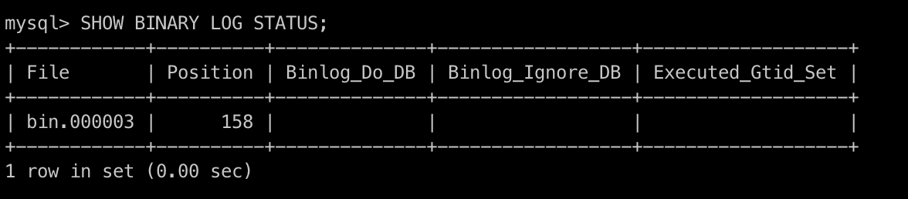
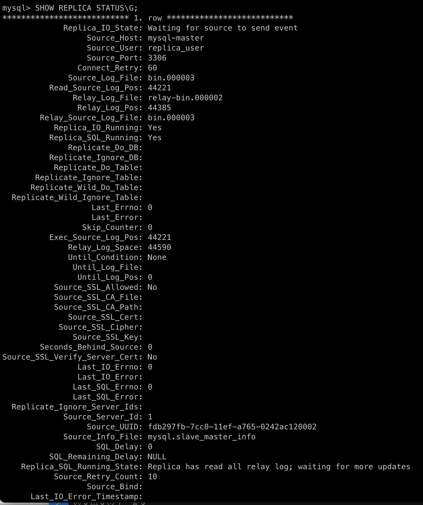
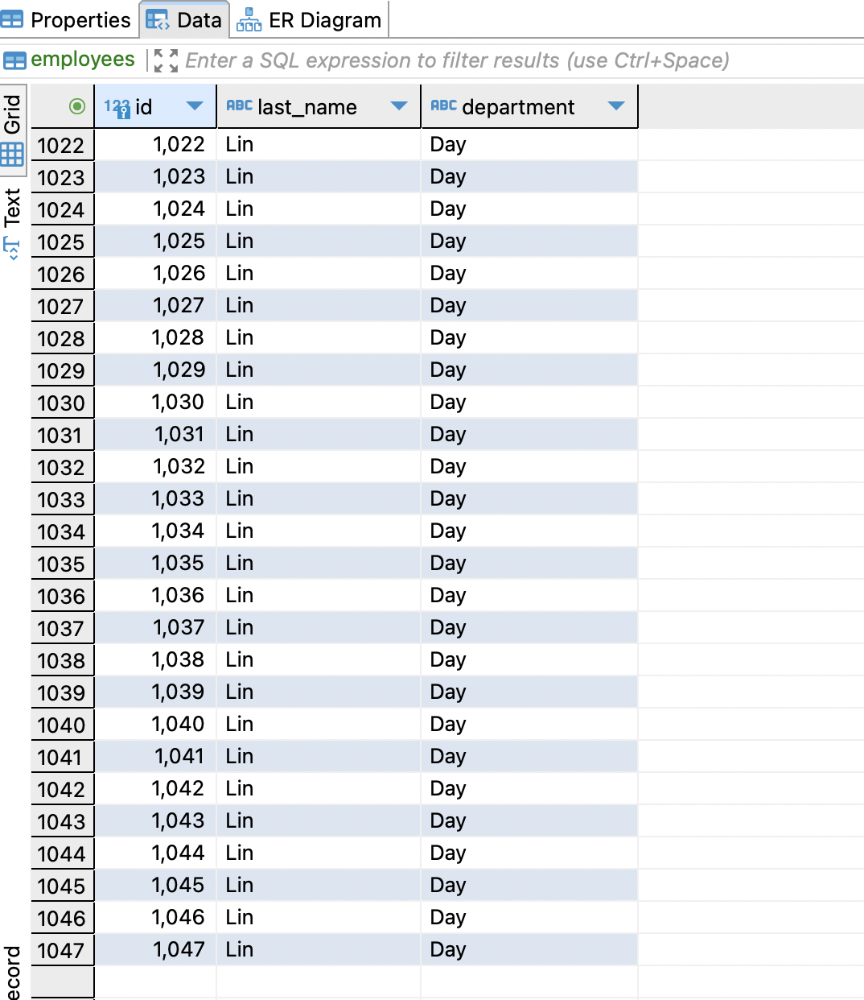
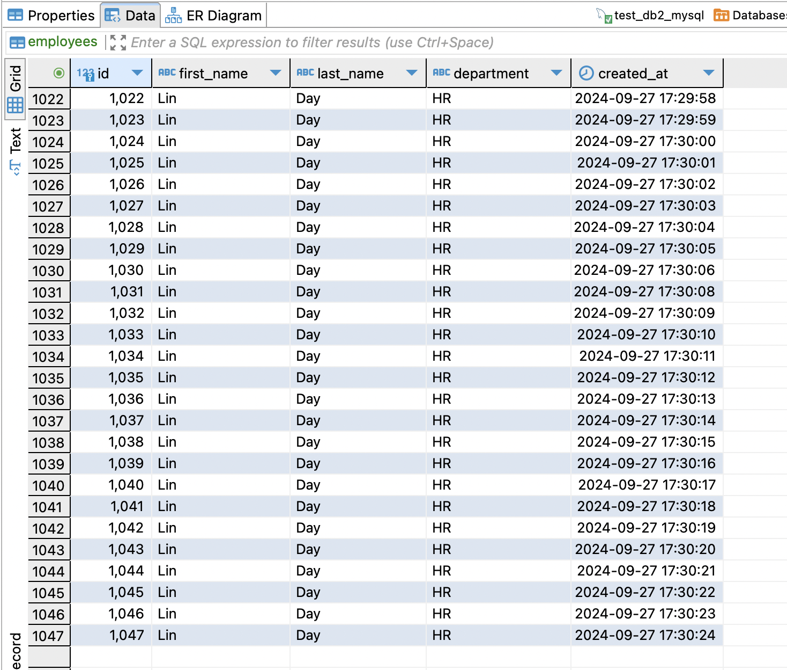

# HSA db replication setup

<h3>MySQL master-slave replication setup</h3>

```
log_bin=mysql-bin
server-id=1
```
The ``server-id`` parameter in MySQL configuration is essential for identifying individual servers in a replication setup. In the context of MySQL Master-Slave replication, each server must have a unique server-id to ensure proper communication and data synchronization between them.

Connect to master and collect binary log info: 
```
docker exec -it {container_name} bash
mysql -uroot -p
mysql> SHOW BINARY LOG STATUS;
```


Connect to slave and start replication:
```
docker exec -it {container_name} bash
mysql -uroot -p
mysql>
CHANGE REPLICATION SOURCE TO
    SOURCE_HOST='mysql-master',
    SOURCE_PORT=3306,
    SOURCE_USER='replica_user',
    SOURCE_PASSWORD='secret',
    SOURCE_LOG_FILE='bin.000003',
    SOURCE_LOG_POS=158,
    GET_SOURCE_PUBLIC_KEY=1;

START REPLICA;
SHOW REPLICA STATUS\G;
```

Replica started
```
2024-09-27 14:12:04 2024-09-27T11:12:04.777188Z 10 [System] [MY-010597] [Repl] 'CHANGE REPLICATION SOURCE TO FOR CHANNEL '' executed'. Previous state source_host='', source_port= 3306, source_log_file='', source_log_pos= 4, source_bind=''. New state source_host='mysql-master', source_port= 3306, source_log_file='bin.000003', source_log_pos= 158, source_bind=''.
2024-09-27 14:12:09 2024-09-27T11:12:09.079437Z 11 [Warning] [MY-010897] [Repl] Storing MySQL user name or password information in the connection metadata repository is not secure and is therefore not recommended. Please consider using the USER and PASSWORD connection options for START REPLICA; see the 'START REPLICA Syntax' in the MySQL Manual for more information.
2024-09-27 14:12:09 2024-09-27T11:12:09.116424Z 11 [System] [MY-014001] [Repl] Replica receiver thread for channel '': connected to source 'replica_user@mysql-master:3306' with server_uuid=fdb297fb-7cc0-11ef-a765-0242ac120002, server_id=1. Starting replication from file 'bin.000003', position '158'.
```

Replica status before replication is started:


Connect to master node and run script ``insert_employees.sh`` (adds record to db every sec)



When slave1 node is stopped, slave2 node continues to replicate data from master node (no impact).

Drop columns in ``employees`` table when data replication is on:
```
ALTER TABLE employees DROP COLUMN created_at; // last column
ALTER TABLE employees DROP COLUMN first_name; // column from the middle
```

No impact, slave nodes continue to replicate data.


